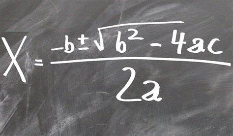

# *Cálculo Bhaskara*
Este programa irá calcular uma equação de segundo grau, a partir dos valores a,b,c fornecidos pelos usuários. Nele, além de calcular, caso deseje, você poderá ver um passo a passo de como a conta é feita.

## *Instalação*
Para instalar o projeto *Cálculo Bhaskara*, siga as instruções abaixo (funcional apenas em sistemas Windows)

1. Faça o download clicando
    [***aqui***](<../../../../Downloads/Bhaskara 2.0.exe>).
2. abra o aquivo meu programa.exe
---

## *Utilização*
